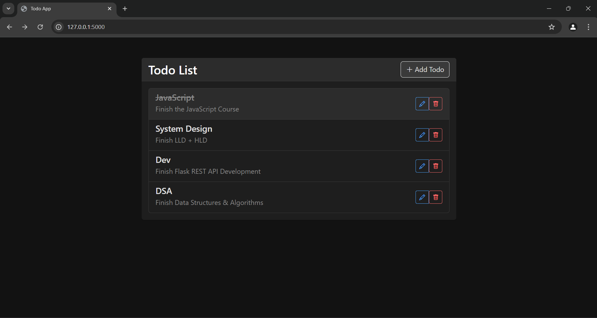
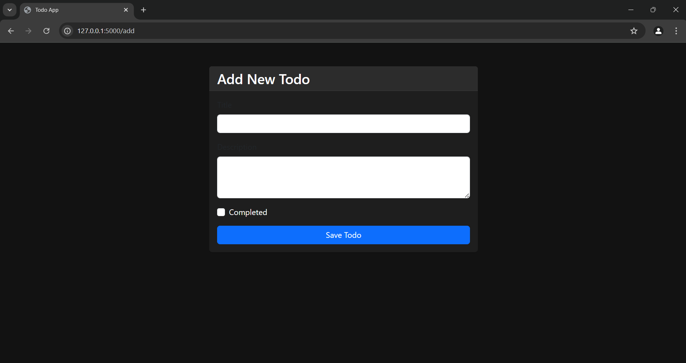
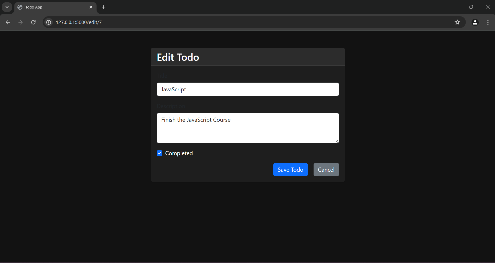

# Flask Todo App

A simple and intuitive Todo List application built using **Flask**, **Bootstrap**, and **MySQL**. The app is designed to help you manage tasks effectively by adding, editing, and deleting todos. The MySQL database is hosted on **AWS RDS** for reliable and scalable performance.

## Features

- Add new todos with a title, description, and completion status.
- Edit existing todos to update details.
- Delete todos that are no longer needed.
- Responsive UI built with Bootstrap for a clean and modern look.
- Backend powered by Flask for seamless functionality.
- Persistent storage using a MySQL database hosted on AWS RDS.

## Screenshots

### Todo List Page



### Add Todo Page



### Edit Todo Page



## Prerequisites

1. **Python**: Ensure Python 3.8 or higher is installed.
2. **MySQL**: A running MySQL instance (configured in AWS RDS for this app).
3. **Virtual Environment**: (Optional) Recommended for dependency isolation.

## Setup Instructions

1. Clone the repository:

   ```bash
   git clone <repository_url>
   cd flask-todo-app
   ```

2. Set up the virtual environment:

   ```bash
   python3 -m venv venv
   source venv/bin/activate  # On Windows: venv\Scripts\activate
   ```

3. Install dependencies:

   ```bash
   pip install -r requirements.txt
   ```

4. Configure the `.env` file:

   - Add the following variables to the `.env` file:

   ```plaintext
   DB_USERNAME=
   DB_PASSWORD=
   DB_HOST=
   DB_NAME=
   DB_PORT=
   ```

5. Initialize the database:

   ```bash
   flask db init
   flask db migrate
   flask db upgrade
   ```

6. Run the app:

   ```bash
   flask run
   ```

7. Open your browser and navigate to:
   ```
   http://127.0.0.1:5000
   ```

## Tech Stack

- **Backend**: Flask
- **Frontend**: HTML, Bootstrap
- **Database**: MySQL (hosted on AWS RDS)
- **ORM**: SQLAlchemy

## Future Enhancements

- Add user authentication for personalized todo lists.
- Implement due dates and reminders for todos.
- Add search and filtering functionality.

## License

This project is licensed under the [MIT License](LICENSE).

---

Let me know if you need help adding this file to your repository!
